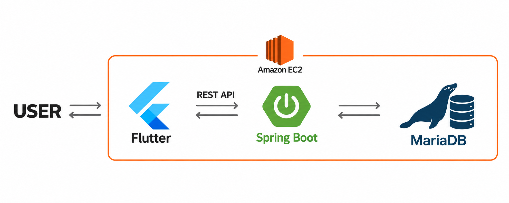
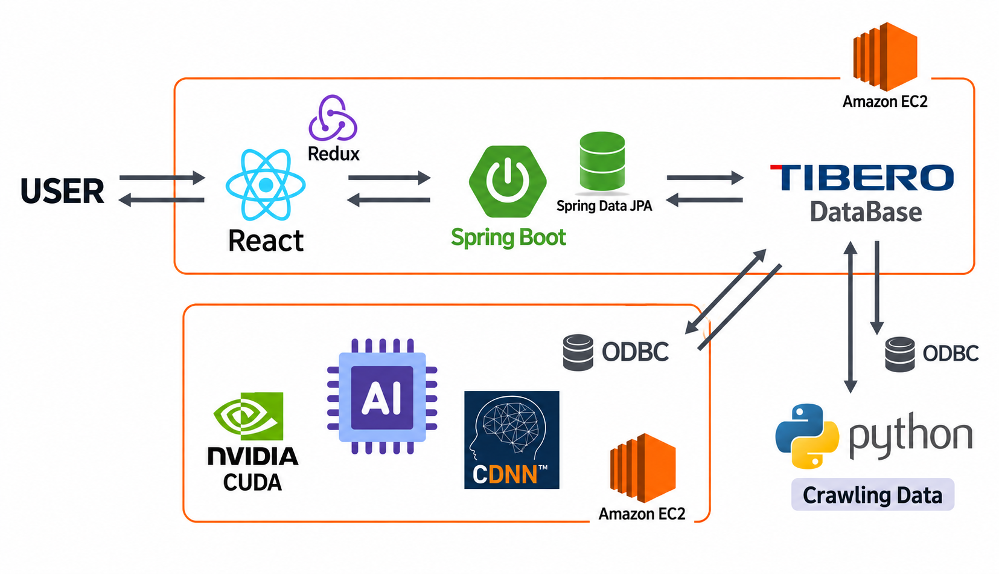
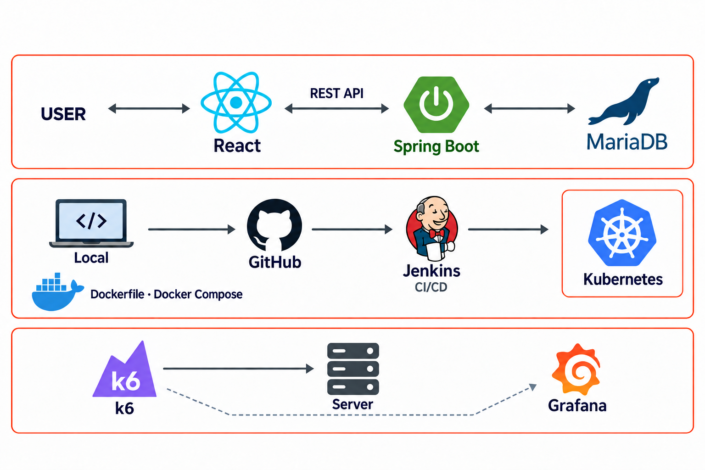

# 강현준 포트폴리오

| 프로젝트 | 담당 역할 | 주요 개발 내용 |
| --- | --- | --- |
| Jiki | 백엔드 · 팀장 | 약속 참여 관리, 접근 권한 검증, 벌금·보상 정산 |
| 다잡아 | 프론트엔드 | 크롤링 기반 채용공고 탐색, 페이지네이션, 자기소개서 관리, 매칭 결과 시각화 |
| 나만의 도서관 | 프론트엔드 · 백엔드 · 배포 환경 구축 | 도서 공유 서비스, Jenkins 배포 자동화, 부하 테스트 |

# Jiki

**약속 참여 여부와 도착 상태에 따른 벌금·보상 정산 서비스**

**담당 역할**　백엔드 개발 · 팀장  
**기술**　Java 17, Spring Boot, Spring Security, JWT, Spring Data JPA, MariaDB, AWS EC2  
**GitHub**　[CapstoneDesign-timeisgold/Back](https://github.com/CapstoneDesign-timeisgold/Back)

### <시스템 구조>

### <핵심 기능>

**약속 관리** - 친구 요청부터 약속 생성, 초대 수락·거절, 참여 취소까지 처리. 참여 마감 이후에는 변경을 제한하고, 수락한 참여자만 정산 대상으로 확정.

**정산** - 도착 상태에 따라 벌금과 보상을 계산하고 잔액·개인 거래 내역에 반영. 실제 결제가 아닌 서비스 내부 정산 시뮬레이션.

### <문제 해결>

#### 1. 요청자 위조와 권한 없는 정산 접근 차단

요청 본문의 사용자명 대신 JWT 인증 정보로 요청자를 식별하도록 변경. 정산은 약속 생성자만 실행할 수 있고, 결과는 생성자와 수락한 참여자만 조회할 수 있도록 권한 검사 추가. 타인의 요청을 처리하거나 정산에 접근하는 경우를 차단하는 테스트 작성.

#### 2. 참여 상태와 정산 시점의 불일치 방지

대기·거절 상태의 사용자까지 정산에 포함되던 문제를 수정하고, `ACCEPTED` 참여자만 계산에 포함. 예정 시각 전 정산과 중복 정산은 `409 Conflict`로 차단하고, 대상 필터링과 미래 약속의 정산 거절에 대한 테스트 작성.

#### 3. 참여 변경과 정산의 동시 처리 제어

수락·취소와 정산 요청이 겹쳐도 정산 대상이 바뀌지 않도록 같은 약속 행에 `PESSIMISTIC_WRITE` 잠금을 걸고 처리. 참여 ID로 변경하는 경우에도 약속 잠금 후 참여 행을 다시 조회해 최신 상태 확인.

#### 4. 순환 의존성으로 인한 서버 기동 실패 해결

`SecurityConfig`와 `UserSecurityService`가 `PasswordEncoder`를 통해 순환 참조하면서 서버 기동 실패. 인코더 Bean을 `PasswordConfig`로 분리해 순환 의존성을 제거하고, Java 17·MariaDB 환경에서 정상 기동을 확인한 내용을 기록.

### <설계와 검증>

약속과 참여자를 별도 엔티티로 구분. 참여 마감은 현재 시각 이후부터 약속 시작 시각까지 설정할 수 있으며, 마감 정각부터 초대·수락·거절·취소를 제한. 외부 참여자가 처음 수락하면 별도 플래그로 마감 변경을 잠그고, 이후 취소하거나 재초대해도 잠금을 유지.

권한과 입력값 검사, 중복 초대, 마감 직전·정각·직후, 정산 후 변경 제한을 테스트. MockMvc로 HTTP 응답을 확인하고 H2로 참여 상태와 마감 정보가 저장되는지 검증하도록 작성.

# 다잡아

**크롤링으로 수집한 채용공고와 자기소개서를 연결하는 채용 매칭 서비스**

**담당 역할**　프론트엔드 개발  
**기술**　React, JavaScript, React Router, Redux Toolkit, redux-persist, Axios  
**GitHub**　[TABA-DaJobA/Front](https://github.com/TABA-DaJobA/Front)

### <시스템 구조>

### <핵심 기능>

**채용공고 탐색** - 크롤링으로 수집한 공고를 서비스 내 목록·상세 페이지로 제공. 직군별 필터와 페이지네이션을 적용하고 메인 화면에 최신 공고 표시.

**자기소개서 관리** - 희망 직군·제목·내용 입력, 글자 수 표시, 저장·조회·수정·삭제. 자기소개서별 매칭 결과 조회.

**매칭 결과 확인** - 기업별 매칭 점수를 차트와 순위로 표시하고 채용공고 상세 화면으로 연결.

### <주요 개발 내용>

#### 1. 크롤링 기반 채용공고 목록과 직군별 탐색

팀에서 크롤링해 저장한 채용 데이터를 API로 받아 공고 이미지와 제목을 카드로 표시. 개발·디자인·마케팅 등 직군을 선택하면 해당 공고를 다시 조회하고, 카드를 누르면 공고 ID에 맞는 상세 화면으로 이동. 메인 화면에는 최신 공고 API를 연동.

#### 2. 서버 페이징 API와 연동한 페이지네이션

채용공고는 한 페이지에 20건씩 요청하고, 응답의 `content`로 목록을, `totalPages`로 페이지 버튼을 표시. 화면에서는 페이지 번호를 1부터 보여주되 API 요청에는 0부터 시작하는 번호를 사용. 페이지가 바뀌면 해당 구간의 데이터를 다시 조회.

페이지 번호는 10개 단위로 표시하고 이전·다음 이동에 맞춰 표시 구간을 변경. 현재 페이지를 강조하고, 첫 페이지의 이전 버튼과 마지막 페이지의 다음 버튼은 비활성화.

#### 3. 채용공고 상세 정보와 근무지 지도 연결

공고 상세 API의 데이터를 주요업무·자격요건·우대사항·혜택 및 복지로 나눠 배치. 마감일이 없으면 상시 채용으로 표시. 기업 소개는 앞부분 100자만 보여주고 더보기·접기 버튼으로 전체 내용을 확인할 수 있도록 처리.

근무지 주소를 Google Maps 정적 지도에 표시하고, 지도를 누르면 해당 주소의 지도 검색 화면으로 이동. 상세 데이터를 불러오는 동안의 로딩 화면과 요청 오류 메시지도 구분해 표시.

#### 4. 자기소개서 작성·수정·목록 관리

희망 직군과 제목·내용을 입력받고, 작성 중 공백을 포함한 글자 수 표시. 저장 후 반환된 자기소개서 ID로 상세 화면에 이동하고, 기존 내용을 불러와 수정한 뒤 PUT 요청으로 반영.

사용자별 자기소개서는 10건 단위로 조회하며 제목과 최종 수정 시각을 목록에 표시. 목록에서 상세 조회·삭제·분석을 실행할 수 있고, 삭제가 끝나면 목록을 다시 불러와 갱신.

#### 5. 기업별 매칭 결과 시각화

자기소개서 ID와 사용자 정보를 기준으로 매칭 API를 호출하고, 기업명·공고명·로고·점수를 카드로 구성. 서버 응답 순서에 따라 순위를 표시하고 첫 결과를 강조. 기업별 점수를 비교할 수 있도록 Chart.js 원형 차트와 소수점 둘째 자리까지의 수치를 함께 표시.

매칭 카드에서 해당 공고 상세 화면으로 바로 이동할 수 있도록 연결. 자기소개서를 작성한 뒤 분석 결과와 채용공고를 차례로 확인할 수 있도록 화면 구성.

# 나만의 도서관

**도서 공유 서비스 개발과 배포 자동화 실습**

**담당 역할**　프론트엔드·백엔드 개발 · 배포 환경 및 CI/CD 구축  
**기술**　React, Spring Boot, Spring Data JPA, MariaDB, Docker, Docker Compose, Kubernetes, Jenkins, k6, Grafana  
**GitHub**　[unfl1/mylibrary](https://github.com/unfl1/mylibrary)

### <시스템 구조>

### <핵심 기능>

**도서 게시글** — 이미지·위치·비용·보증금을 포함한 게시글 등록. 목록·상세 조회, 제목 검색, 내 게시글 조회·삭제.

**회원·댓글** — 회원가입·로그인과 게시글 댓글 기능.

### <주요 개발 내용>

#### 1. 개발 환경부터 서버 배포까지 자동화

Dockerfile과 Docker Compose로 실행 환경을 구성하고 Kubernetes에 배포. Jenkins CI/CD를 구축해 로컬에서 수정한 코드를 GitHub에 반영하면 실습 서버의 빌드·배포로 이어지도록 자동화.

#### 2. 부하 상황의 서비스 동작 확인

k6로 부하를 주고 Grafana에서 테스트 지표 확인. 로그도 함께 살펴보며 요청이 몰릴 때 서비스가 어떻게 동작하는지 확인.

#### 3. 게시글 정보와 이미지의 통합 업로드

React 작성 폼에서 텍스트와 이미지를 `FormData`에 담아 전송하고, Spring Boot에서 `MultipartFile`로 받아 파일 시스템에 저장. 이미지 경로를 게시글과 연결해 목록·상세 화면에서 작성자 정보와 함께 표시.

#### 4. 조회 목적에 따른 API 응답 구성

전체 목록·상세·내 게시글 화면에 맞춰 응답 DTO를 분리하고, 제목 검색은 `findByTitleContainingIgnoreCase`로 처리. 상세 조회 시 조회 수를 증가시키고 댓글 기능은 별도의 컨트롤러·서비스·저장소로 구성.
