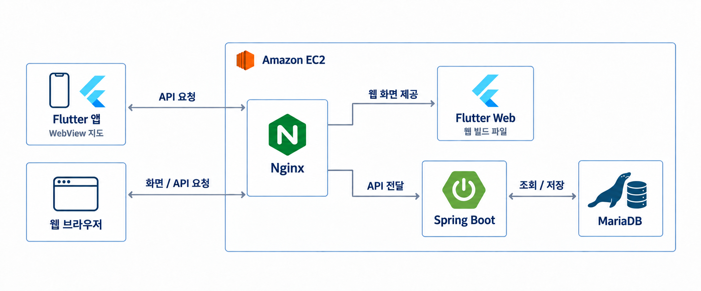
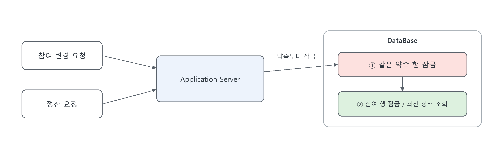
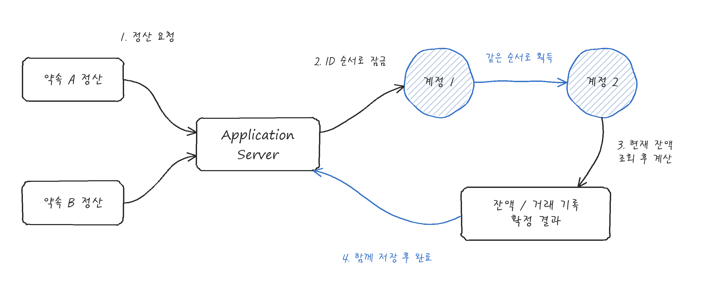
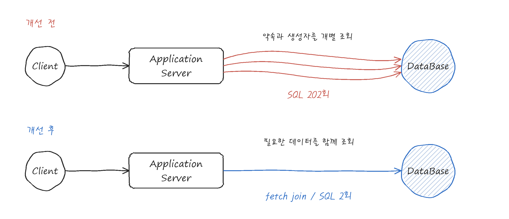
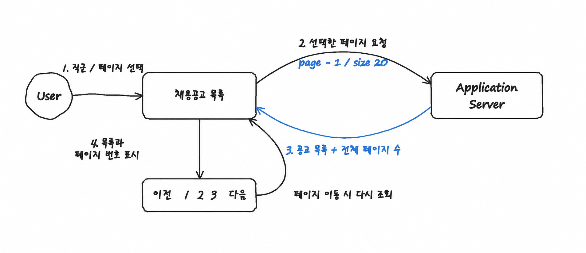
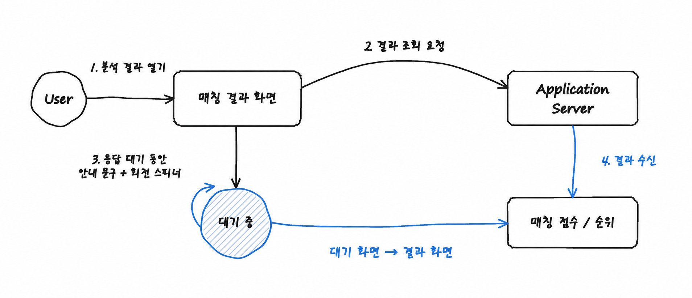
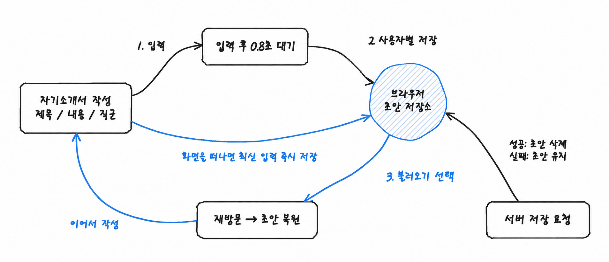
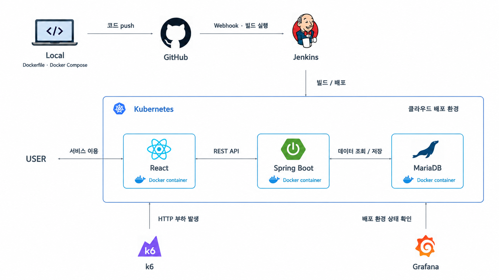
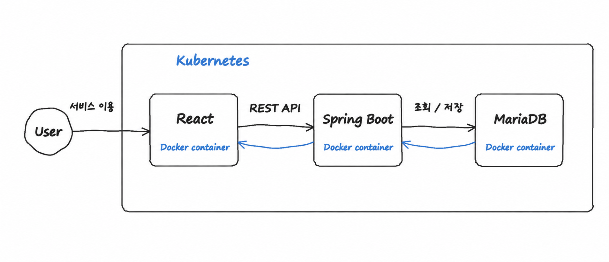
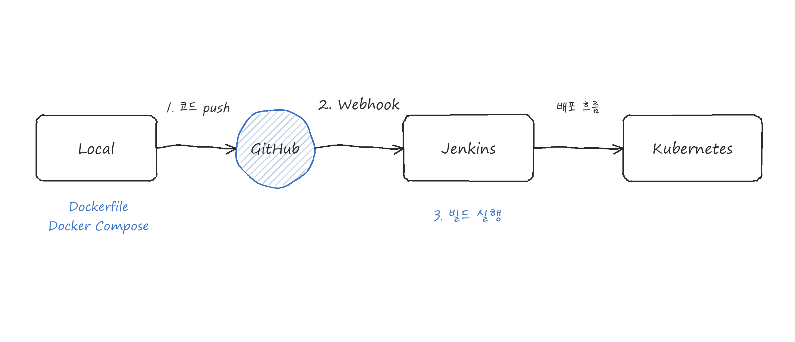

# 강현준 포트폴리오

[포트폴리오 웹사이트](https://unfl1.github.io/portfolio/)

| 프로젝트 | 담당 역할 | 주요 개발 내용 |
| --- | --- | --- |
| [Jiki](#jiki) | 백엔드 개발 및 팀장 | 약속 참여 관리, 접근 권한 검증, 벌금과 보상 정산 |
| [다잡아](#다잡아) | 프론트엔드 | 크롤링 기반 채용공고 탐색, 페이지네이션, 자기소개서 관리, 매칭 결과 시각화 |
| [나만의 도서관](#나만의-도서관) | 프론트엔드와 백엔드 개발, 배포 환경 구축 | 도커 - 쿠버네티스 환경 실습, 도서 공유 서비스, Jenkins 배포 자동화, 부하 테스트 |

 
 

# Jiki

**약속 참여 여부와 도착 상태에 따른 벌금과 보상 정산 서비스**

**담당 역할**: 백엔드, 팀장 
**기술**: Java, Spring Boot, Spring Data JPA, Spring Security, MariaDB 
**GitHub**: [CapstoneDesign-timeisgold/Back](https://github.com/CapstoneDesign-timeisgold/Back)

## 시스템 구조

## 핵심 기능

- 약속 - 약속 생성 및 조회, 참여자 초대, 초대 수락과 거절, 참여 취소, 참여 마감 설정, 도착 상태 관리
- 정산 - 벌금과 보상 계산, 내부 잔액 반영, 정산 결과 및 거래 내역 조회
- 기타 - JWT 인증, 친구 요청과 수락 및 거절, 친구 목록 조회

## 문제 해결

### 1. 참여 상태 변경과 정산의 충돌 방지

#### 전체적인 아키텍처

#### 문제 발견과 원인

- 참여 마감과 취소 기능 구현 중, 참여 상태 변경과 정산이 동시에 실행되면 정산 대상이 달라질 수 있는 구조 확인.
- 정산 대상 조회와 실제 금액 반영 사이에 참여 상태가 바뀔 가능성 존재.
- 잠금 대기 전에 읽은 참여 상태를 그대로 사용할 경우, 다른 요청이 변경한 최신 상태를 반영하지 못할 가능성 존재.

#### 해결 과정

- 정산 대상을 유지하려면 같은 약속의 참여 변경과 정산을 순서대로 처리해야 한다고 판단. 참여 변경과 정산 모두 동일한 약속 행에 PESSIMISTIC_WRITE 잠금을 적용.
- 잠금 대기 중 변경된 상태를 반영하기 위해, 참여 ID로 변경하는 요청도 약속을 먼저 잠근 뒤 참여 행을 잠금 조회하도록 변경.
- 참여 마감과 정산 완료 여부에 따라 변경을 거절하고, 정산 대상은 수락한 참여자로 제한.

#### 테스트

- 마감 직전의 수락과 취소 허용, 마감 정각부터 변경 거절 여부 확인.
- 정산이 끝난 약속의 도착 상태 변경 거절 여부 확인.
- H2 JPA 테스트로 참여 상태와 마감 정보, 첫 수락 이후의 마감 변경 제한 저장 여부 확인.

#### 결과

- 같은 약속의 참여 변경과 정산을 순서대로 처리하고, 잠금 획득 후 최신 참여 상태를 확인하도록 변경.

### 2. 동시 정산 충돌과 금액 누락을 해결하고 재시도 정상 처리

#### 전체적인 아키텍처

#### 문제 발견과 원인

- 서로 다른 약속이 같은 계정을 동시에 정산하도록 실행 시점을 맞춘 실험에서, 20회 모두 한 트랜잭션의 데드락 실패 확인. 약속별 잠금만으로 공유 계정의 갱신 순서를 통제할 수 없는 구조.
- 사용자 엔티티를 먼저 조회한 경우, 계정 잠금을 추가해도 이미 읽은 잔액이 최신 값으로 바뀌지 않는 점 고려.
- 벌금 1,000원을 3명에게 나누는 실험에서 각 333원만 지급되어 전체 잔액 1원 소실. 정수 나눗셈의 나머지 처리 누락이 원인.
- 전원 지각 시 관리자 잔액만 증가하고 입금 내역이 남지 않아, 잔액과 거래 기록의 불일치 확인.
- 완료된 정산의 재요청은 중복 반영 방지를 위해 409 반환. 응답을 받지 못해 다시 요청한 경우에도 정상 완료로 처리하지 못하는 한계 확인.

#### 해결 과정

- 서로 다른 약속이 공유하는 계정의 교차 대기를 피하기 위해, 관리자까지 포함한 전체 대상 계정의 잠금 순서를 사용자 ID 기준으로 통일.
- 계정 잠금 후 DB의 현재 잔액을 직접 조회. 기존 JPA 엔티티에 남아 있는 과거 잔액 대신 조회한 값을 계산에 사용하고, 잔액 컬럼만 갱신.
- 잔액 변경, 거래 기록, 확정 결과와 정산 완료 상태를 같은 트랜잭션으로 저장. 중간 오류 발생 시 전체 롤백 적용.
- 모든 잔액 변화를 추적할 수 있도록 나머지의 관리자 적립과 거래 내역 저장 적용. 전원 지각 시 관리자 입금도 기록.
- 약속 ID를 재시도 식별자로 사용. 새 방식으로 완료된 정산은 저장된 결과를 사용해 금액 재반영 없이 204 반환. 약속 ID, 사용자 ID, 입출금 방향의 유일 제약 추가.

#### 테스트

- 각 계정의 초기 잔액을 10,000원으로 설정하고, 같은 두 사용자가 포함된 서로 다른 약속 2개의 동시 정산을 20회 반복. 두 트랜잭션이 사용자 정보를 읽은 뒤 barrier로 실행 시점 조정.
- 관리자를 공유하고 두 약속에서 지각자와 정시 도착자의 역할이 뒤바뀌는 동시 정산을 추가로 10회 검증.
- 관리자 계정 누락, 정수 범위 초과, 중복 거래 제약 위반 시 잔액과 기록, 정산 완료 상태의 전체 롤백 확인. 일반 테스트 82개 통과.
- 같은 정산에 k6 VU 10으로 총 100회 요청하는 실험을 새 약속으로 3회 반복. 응답 코드와 실제 잔액, 거래 기록 수 확인.

#### 결과

- 동시 정산 20회 실험에서 데드락 실패 20회 → 0회. 개선 후 두 정산이 모두 완료되고 잔액과 거래 기록이 기대값과 일치.
- 추가 동시 정산 10회에서 관리자 적립과 전체 잔액 보존을 확인하고, 거래 기록에 저장된 잔액이 해당 시점까지의 입출금 합계와 일치하는지 검증.
- 벌금 1,000원 배분 시 참여자 3명에게 각 333원, 관리자에게 1원이 반영되어 전체 잔액 보존.
- 재시도 실험의 204 응답: 3/300 → 300/300. 개선 전후 모두 약속별 금액 반영은 한 번으로 유지. 개선 후 반복 요청도 정상 처리.

### 3. 약속 목록 N+1 개선으로 SQL 202회에서 2회로 감소

#### 전체적인 아키텍처

#### 문제 발견과 원인

- 수락한 약속이 10개일 때 SQL 22회, 50개일 때 102회, 100개일 때 202회 실행되는 문제 재현.
- 참여 정보 조회 후 지연 로딩된 약속과 생성자에 접근하면서 개별 SQL이 반복 실행되는 원인 확인.
- 애플리케이션에서 수락 상태를 필터링하는 구조로, 목록에 필요한 조건과 연관 데이터가 최초 조회에 반영되지 않은 상태 확인.

#### 해결 과정

- 필요한 약속과 생성자를 처음부터 함께 가져오면 반복 조회를 없앨 수 있다고 판단. 수락 상태를 DB 조회 조건으로 옮기고 약속과 생성자에 fetch join 적용.
- 약속 수가 늘어도 SQL 횟수가 일정하게 유지되는지 확인하는 회귀 테스트 추가.
- SQL 감소가 응답 시간에 미치는 영향을 확인하기 위해, 같은 데이터와 부하 조건에서 개선 전후를 k6로 비교.

#### 테스트

- 약속 10개, 50개, 100개에 대한 서비스 조회 SQL 횟수 비교.
- 약속 100개 기준 k6 VU 1, 10, 30 조건에서 실행. 조건별로 5초간 워밍업한 뒤 10초씩 3회 측정.
- HTTP 오류와 응답 데이터의 기대값 일치 여부 검사.

#### 결과

- 약속 100개 기준 서비스 SQL: 202회 → 2회, 약 99% 감소. 약속 10개와 50개에서도 각각 2회로 유지.
- VU 10에서 p95 응답 시간의 3회 중앙값: 58.09ms → 8.81ms, 84.8% 감소.
- 개선 전후 본 측정 총 82,405건에서 HTTP 오류와 응답 데이터 불일치 0건.

## 근거 자료

- [목록 조회 개선 기록](https://github.com/CapstoneDesign-timeisgold/Back/blob/main/back/docs/IMPROVEMENT_LOG.md)
- [참여 마감 설계와 검증 범위](https://github.com/CapstoneDesign-timeisgold/Back/blob/main/back/docs/PARTICIPATION_DEADLINE.md)
- [정산 설계와 측정 조건](https://github.com/CapstoneDesign-timeisgold/Back/blob/main/back/docs/SETTLEMENT_INTEGRITY.md)
- [Nginx 설정과 실행 안내](https://github.com/CapstoneDesign-timeisgold/Back/tree/main/back/deploy/nginx)

 
 

# 다잡아

**AI로 자기소개서를 분석해 크롤링으로 수집한 채용공고와 매칭하는 서비스**

**담당 역할**: 프론트엔드 
**기술**: JavaScript, React, Redux Toolkit, React Redux, Redux Persist, Tailwind CSS 
**GitHub**: [TABA-DaJobA/Front](https://github.com/TABA-DaJobA/Front)

## 시스템 구조

## 핵심 기능

- **채용공고 탐색**: 직군별 필터, 페이지네이션, 공고 상세 조회
- **자기소개서 관리**: 작성, 조회, 수정, 삭제, 글자 수 표시, 새 자기소개서 초안 저장과 복원
- **매칭 결과 확인**: 기업별 매칭 점수와 순위 시각화, 추천 공고 연결

## 사용자 경험 개선

### 1. 서버 페이지네이션으로 채용공고 조회 범위와 탐색 방식 개선

#### 전체적인 아키텍처

#### 개선 배경

- 초기에는 모든 채용공고를 한 페이지에 불러와 로딩에 시간이 걸리고, 긴 목록에서 어디까지 확인했는지 알기 어렵다는 사용자 의견 확인.
- 현재 화면에서 필요한 범위를 구분하지 않고 전체 목록을 불러오는 방식이어서, 조회 범위를 나누고 탐색 위치를 표시할 필요가 있었음.

#### 개선 과정

- 한 번에 요청하는 공고 수를 줄이고 현재 탐색 위치를 보여주기 위해 서버 페이지네이션 API 연동. 페이지당 최대 20건을 요청하도록 구성.
- 화면과 서버의 페이지 번호 기준을 맞춰 선택한 페이지의 공고를 조회하고, 서버에서 받은 전체 페이지 수를 탐색 버튼에 반영.
- 페이지 번호를 10개 단위로 표시하고 현재 페이지를 강조. 이전과 다음 버튼으로 페이지를 이동할 때 번호 표시 구간도 함께 변경.

#### 테스트

- 페이지당 20건을 요청하는 조건과 화면의 페이지 번호가 API 요청에 맞게 변환되는지 확인.
- 응답의 공고 목록과 전체 페이지 수가 화면에 반영되는 흐름 확인.
- 첫 페이지에서는 이전 버튼을, 마지막 페이지에서는 다음 버튼을 비활성화하는 조건과 10페이지 구간 전환 로직 확인.

#### 결과

- 전체 공고를 한 번에 요청하던 방식에서 페이지당 최대 20건을 요청하는 구조로 변경.
- 사용자가 현재 페이지를 확인하고, 목록을 나누어 탐색할 수 있도록 구성.

### 2. 분석 대기 화면에 스피너를 추가해 대기 상태 안내

#### 전체적인 아키텍처

#### 개선 배경

- 초기에는 분석을 기다리는 동안 정적인 문구만 표시하여, 사용자가 결과를 기다리는 상황인지 화면이 멈춘 것인지 구분하기 어렵다는 의견 확인.
- 비동기 결과 조회 중 대기 상태를 시각적으로 전달하는 표시가 부족했음.

#### 개선 과정

- 정적인 문구만으로는 대기 상태를 전달하기 어렵다고 판단. 안내 문구 옆에 CSS 회전 애니메이션을 적용한 원형 스피너 추가.
- 서버에서 매칭 결과를 받으면 대기 안내 대신 결과 화면을 표시하도록 구성.

#### 테스트

- 대기 안내 문구와 함께 스피너에 회전 애니메이션이 적용되는지 확인.
- 매칭 결과 데이터가 들어오면 대기 화면에서 결과 화면으로 전환되는 흐름 확인.

#### 결과

- 정적인 안내 문구에 회전하는 스피너를 추가해 결과를 기다리는 상황을 시각적으로 안내.

### 3. 자기소개서 초안 자동 저장과 복원으로 작성 내용 유실 방지

#### 전체적인 아키텍처

#### 개선 배경

- 새 자기소개서 작성 중 저장 전에 새로고침하거나 다른 화면으로 이동하면 입력 내용이 사라지는 문제 확인.
- 입력값을 화면 상태에만 보관하면 화면이 해제된 뒤 복원할 수 없음.
- 지연 저장만 적용하면 저장 대기 시간 안에 화면을 떠날 때 마지막 입력이 누락될 수 있음. 계정 변경이나 늦게 도착한 서버 응답이 초안에 영향을 주는 경우도 고려.

#### 개선 과정

- 작성 화면에 다시 방문해도 내용을 이어 쓸 수 있도록 브라우저 저장소에 초안을 보관. 입력할 때마다 저장하지 않고, 입력을 멈춘 뒤 0.8초가 지나면 제목과 내용, 희망 직군을 저장하도록 구현.
- 저장 대기 중 화면을 떠나도 마지막 입력이 빠지지 않도록, 새로고침이나 화면 이동 시 저장하지 못한 최신 내용을 즉시 저장.
- 다른 계정의 작성 내용이 섞이지 않도록 사용자별로 초안을 구분하고, 계정이 바뀌면 작성 화면의 입력 상태도 초기화. 재방문 시 초안을 불러오거나 삭제하도록 선택권 제공.
- 서버 저장 성공 시 초안을 삭제하고, 실패 시 입력 내용을 유지해 재시도 가능하도록 구현. 저장 중 중복 제출 차단.
- 화면을 떠난 뒤 도착한 서버 응답이 새 초안을 삭제하지 않도록 처리. 서버 저장 성공 후 초안 삭제만 실패한 경우에는 재제출을 막고 저장된 글로 이동할 수 있도록 구성.

#### 테스트

- Jest와 React Testing Library로 입력 지연 저장과 제목, 내용, 희망 직군의 복원 여부를 검증. 저장 대기 중 화면을 떠나도 마지막 입력이 보존되는지 확인.
- 사용자별 초안 분리, 초안 삭제, 서버 저장 실패 후 재시도와 중복 제출 차단 검증.
- 저장소 쓰기 실패, 손상된 저장 데이터, 이탈 후 늦은 서버 응답, 서버 저장 성공 후 초안 삭제 실패 검증.
- 자동 테스트 11개 모두 통과.

#### 결과

- 같은 브라우저에서 새 자기소개서 작성 화면을 다시 열면 저장된 초안을 선택해 이어서 작성 가능.
- 저장 대기 중 화면을 떠나는 경우에도 마지막 입력을 보존하도록 처리하고, 서버 저장 실패 시 입력 내용과 초안을 유지.
- 사용자 변경과 늦은 서버 응답에 따른 초안 간섭을 방지하는 동작을 자동 테스트로 확인.

 
 

# 나만의 도서관

**Docker와 Kubernetes 기반 클라우드 배포 및 운영**

**담당 역할**: 프론트엔드 및 백엔드 개발, 클라우드 배포 환경 구축, Jenkins 빌드 자동화 
**기술**: React, Java, Spring Boot, Spring Data JPA, MariaDB, Docker, Kubernetes, Jenkins, k6, Grafana 
**GitHub**: [백엔드](https://github.com/unfl1/mylibraryback) / [프론트엔드](https://github.com/unfl1/mylibraryfront) / [클라우드 배포 버전](https://github.com/unfl1/mylibrary)

## 시스템 구조

## 핵심 기능

- 도서 공유 - 도서 대여 게시글 등록, 목록 및 상세 조회, 제목 검색, 본인 게시글 조회와 삭제
- 이미지 및 댓글 - 게시글 이미지 첨부와 조회, 댓글 기능
- 회원 - 회원가입과 로그인

직접 개발한 서비스를 대상으로 Docker 이미지 구성, Kubernetes 배포 환경 구축, Jenkins 빌드 자동화, k6 부하 테스트 및 수동 Pod 확장 수행

## 배포 환경 구축

### 1. 프론트엔드 및 백엔드 컨테이너화와 Kubernetes 배포

#### 구성

| 배포 대상 | 이미지 구성 | 실행 방식 |
| --- | --- | --- |
| 프론트엔드 | Node.js 20.12.2 기반, 의존성 설치 후 React 빌드 | `serve -s build`로 정적 파일 제공, 포트 3000 |
| 백엔드 | OpenJDK 17 기반, 빌드된 JAR을 `/app/app.jar`로 복사 | `java -jar app.jar`로 실행, 포트 8080 |

#### 구축 과정

- 프론트엔드와 백엔드 저장소 분리 및 개별 Dockerfile 작성
- 프론트엔드 이미지 빌드 시 `npm install`과 `npm run build` 실행, `serve`를 통한 빌드 결과물 제공
- 백엔드 이미지에 `build/libs`의 JAR 포함 및 Java 17 실행 환경 구성
- 생성한 Docker 이미지를 사용한 클라우드 Kubernetes 환경 배포
- 배포 환경에 맞게 DB 연결, 외부 API 접근, 이미지 파일 저장 위치 조정

#### 결과

- 프론트엔드와 백엔드 컨테이너의 Kubernetes 환경 실행
- Dockerfile을 통한 서비스별 실행 환경과 시작 명령 관리

### 2. GitHub Webhook과 Jenkins 연동 및 빌드 자동화

#### 구성

#### 구축 과정

- 클라우드 서버에 Jenkins 설치 및 GitHub 저장소 Webhook 연동
- 코드 push 시 Jenkins 빌드 자동 실행 설정
- Jenkins 빌드 실행 결과 확인

#### 결과

- GitHub 코드 변경 감지부터 Jenkins 빌드 실행까지 자동화

### 3. k6 부하 테스트와 수동 Pod 확장

#### 수행 구성

| 도구 | 수행 내용 |
| --- | --- |
| k6 | 배포된 서비스에 HTTP 요청을 보내 부하 발생 |
| Kubernetes | Pod 수를 수동으로 늘리는 스케일 아웃 수행 |
| Grafana | 대시보드에서 배포 환경의 상태 확인 |

#### 수행 과정

- Kubernetes에 배포한 서비스를 대상으로 k6 부하 테스트 수행
- 부하 테스트 과정에서 Pod 수 수동 증설 및 서비스 실행 규모 조정
- Grafana 대시보드를 통한 배포 환경 상태 확인

#### 수행 결과

- 클라우드 서비스 부하 테스트 및 Kubernetes 수동 스케일 아웃 수행
