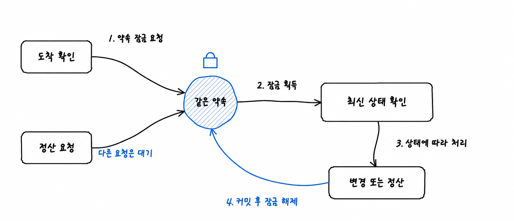
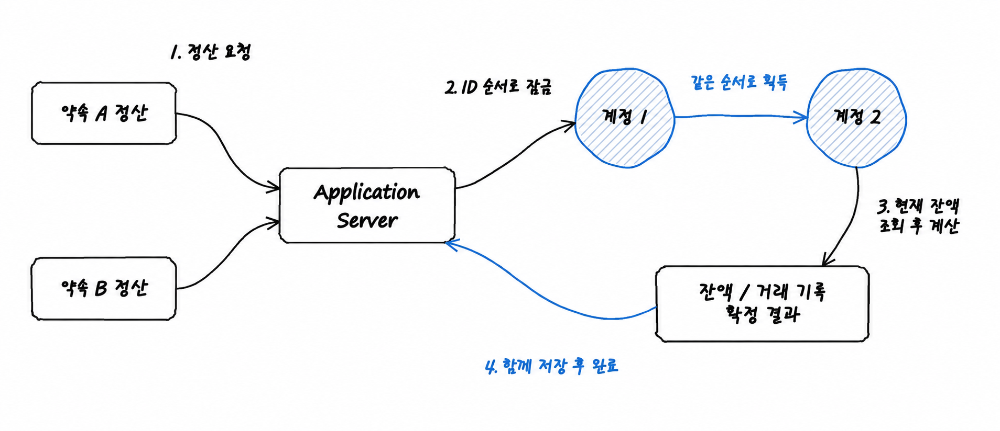
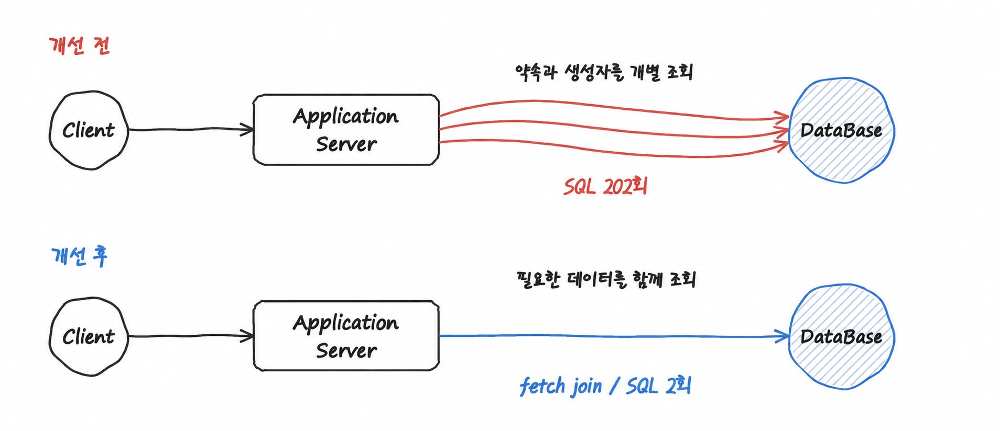
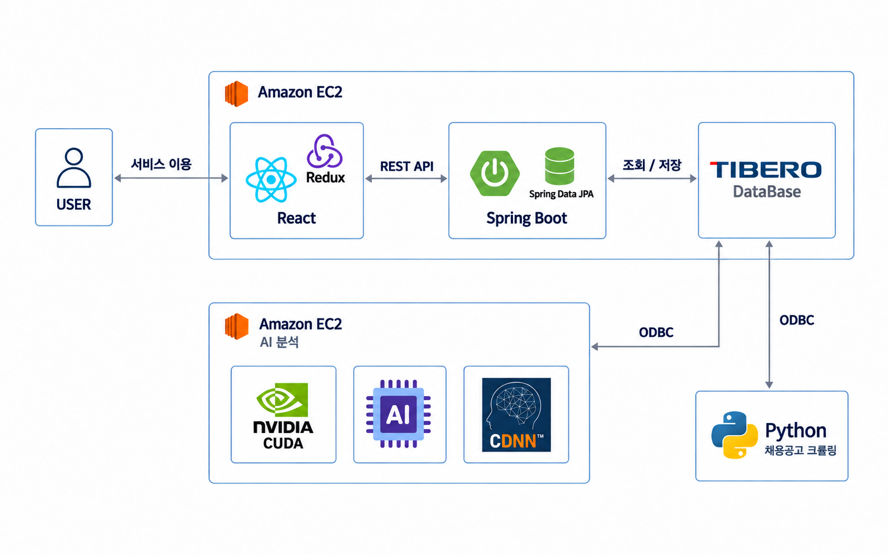
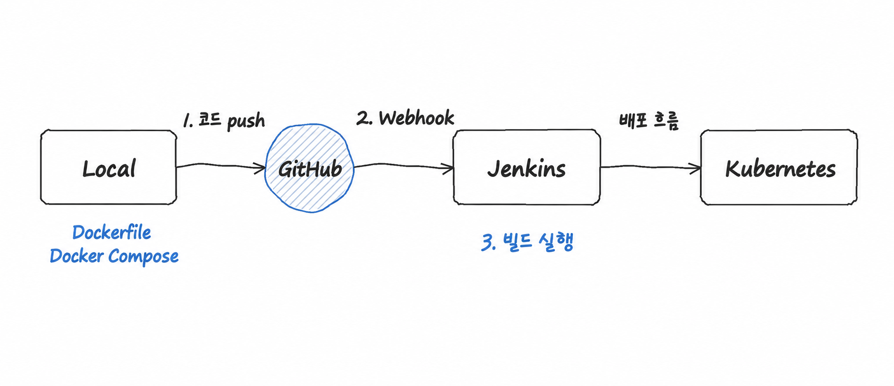
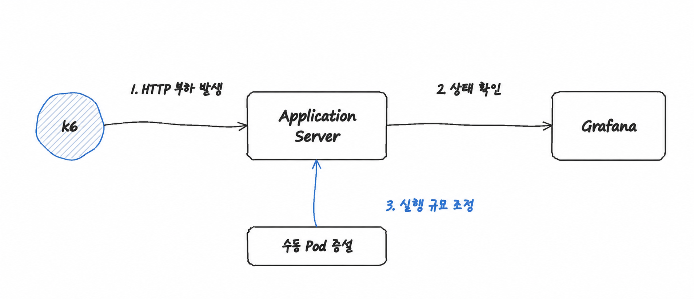

# 강현준 포트폴리오

[포트폴리오 웹사이트](https://unfl1.github.io/portfolio/)

| 프로젝트 | 담당 역할 | 주요 개발 내용 |
| --- | --- | --- |
| [Jiki](#jiki) | 백엔드 개발 및 팀장 | 약속 참여 관리, 접근 권한 검증, 벌금과 보상 정산 |
| [다잡아](#다잡아) | 프론트엔드 | 크롤링 기반 채용공고 탐색, 페이지네이션, 자기소개서 관리, 매칭 결과 시각화 |
| [나만의 도서관](#나만의-도서관) | 프론트엔드와 백엔드 개발, 배포 환경 구축 | 도커 - 쿠버네티스 환경 실습, 도서 공유 서비스, Jenkins 배포 자동화, 부하 테스트 |

 
 

# Jiki

**약속 참여 여부와 도착 상태에 따른 벌금과 보상 정산 서비스**

**담당 역할**: 백엔드 개발, 팀장 
**기술**: Java, Spring Boot, Spring Data JPA, Spring Security, MariaDB 
**저장소**: [GitHub ↗](https://github.com/CapstoneDesign-timeisgold/Back)

## 시스템 구조

## 핵심 기능

- 약속 - 약속 생성 및 조회, 참여자 초대, 초대 수락과 거절, 참여 취소, 참여 마감 설정, 도착 상태 관리
- 정산 - 벌금과 보상 계산, 내부 잔액 반영, 정산 결과 및 거래 내역 조회
- 기타 - JWT 인증, 친구 요청과 수락 및 거절, 친구 목록 조회

## 문제 해결

### 1. 참여 상태 변경과 정산의 충돌 방지

#### 전체적인 아키텍처

#### 문제

- 참여 마감과 취소 기능 구현 중 정산 대상 조회 후 금액 반영 전에 참여 상태가 바뀌면 정산 기준도 달라질 수 있음을 확인
- 잠금 대기 전에 읽은 참여 상태를 다른 요청 처리 후에도 사용해 최신 변경을 반영하지 못하는 문제 발생

#### 해결

- 참여 변경과 정산에 같은 약속 행의 `PESSIMISTIC_WRITE` 잠금을 적용해 정산 중 참여 상태 변경 방지
- 약속 행을 먼저 잠근 뒤 참여 행을 잠금 조회해 대기 중 바뀐 상태까지 반영하고 최신 상태로 처리
- 마감 이후나 정산 완료 후 변경을 차단하고 수락한 참여자만 정산 대상에 포함

#### 결과

- 참여 변경과 정산의 처리 순서를 통일하고 잠금 획득 후 최신 상태를 확인하도록 변경
- 마감 직전 변경 허용, 마감 정각부터 변경 차단, 정산 완료 후 도착 상태 변경 차단 검증
- H2 JPA 테스트로 참여 상태와 마감 정보 저장, 첫 수락 이후 마감 변경 제한 확인

### 2. 동시 정산 충돌과 금액 누락을 해결하고 재시도를 정상 처리

#### 전체적인 아키텍처

#### 문제

- 약속별 잠금만으로는 공유 계정의 갱신 순서를 통제하지 못해 서로 다른 약속의 동시 정산 실험 20회 모두 데드락 발생
- 계정 잠금 전에 읽은 잔액을 그대로 사용하면 다른 정산이 반영한 최신 잔액을 놓칠 수 있음
- 벌금 배분 후 남은 금액의 처리와 관리자 입금 기록이 누락돼 전체 잔액 소실과 거래 내역 불일치 발생
- 완료된 정산의 재요청에도 409를 반환해 응답 유실 후 재시도를 정상 처리하지 못하는 문제

#### 해결

- 교차 대기를 피하려고 관리자 계정까지 사용자 ID 순서로 잠금 적용
- 과거 잔액으로 계산하지 않도록 잠금 획득 후 DB의 현재 잔액을 조회해 정산에 사용
- 벌금 배분 후 남은 금액을 관리자에게 적립하고 잔액, 거래 내역, 확정 결과를 한 트랜잭션으로 저장해 함께 반영
- 재요청 시 약속 ID로 확정 결과를 재사용하고 204를 반환해 금액 재반영과 중복 거래 기록 방지

#### 결과

- 동시 정산 20회에서 데드락 실패가 20회 → 0회로 줄고 잔액과 거래 기록이 일치함을 확인
- 1,000원을 3명에게 각 333원씩 지급하고 관리자에게 1원을 적립해 전체 잔액 보존
- k6 VU 10 재시도 300건 중 204 응답이 3건 → 300건으로 늘고 금액은 약속별 1회만 반영
- 일반 테스트 82개를 통과해 정산 동작과 오류 발생 시 전체 롤백 검증

### 3. 약속 목록 N+1 개선으로 SQL 202회에서 2회로 감소

#### 전체적인 아키텍처

#### 문제

- 수락한 약속 50개에서 SQL 102회, 100개에서 202회가 실행돼 약속 수에 따라 조회 횟수가 늘어남을 확인
- 참여 정보 조회 후 지연 로딩된 약속과 생성자에 접근할 때마다 개별 SQL이 실행되는 원인 확인
- 수락 상태를 애플리케이션에서 필터링해 목록에 필요한 조건과 연관 데이터를 최초 DB 조회에 반영하지 못한 구조

#### 해결

- 반복 조회를 없애려고 약속과 생성자에 fetch join을 적용해 필요한 연관 데이터를 처음부터 함께 조회
- 수락한 약속만 DB에서 가져오도록 상태 조건을 조회 쿼리에 반영
- 약속 50개와 100개에서 SQL 실행 횟수가 일정한지 확인하는 회귀 테스트 추가
- 동일 데이터로 k6 VU 1, 10, 30에서 개선 전후를 각 3회 측정하고 응답 데이터 검증

#### 결과

- 약속 100개 조회 시 SQL이 202회 → 2회로 약 99% 줄고 50개에서도 2회로 유지돼 목록 크기에 따른 SQL 증가 해소
- VU 10의 p95 응답 시간 중앙값(3회 측정) 58.09ms → 8.81ms로 84.8% 감소
- 개선 전후 본 측정 82,405건에서 HTTP 오류와 응답 데이터 불일치 모두 0건

## 코드와 설계 기록

- [목록 조회 개선 기록 ↗](https://github.com/CapstoneDesign-timeisgold/Back/blob/main/back/docs/IMPROVEMENT_LOG.md)
- [참여 마감 설계와 검증 범위 ↗](https://github.com/CapstoneDesign-timeisgold/Back/blob/main/back/docs/PARTICIPATION_DEADLINE.md)
- [정산 설계와 측정 조건 ↗](https://github.com/CapstoneDesign-timeisgold/Back/blob/main/back/docs/SETTLEMENT_INTEGRITY.md)
- [Nginx 설정과 실행 안내 ↗](https://github.com/CapstoneDesign-timeisgold/Back/tree/main/back/deploy/nginx)

# 다잡아

**AI로 자기소개서를 분석해 크롤링으로 수집한 채용공고와 매칭하는 서비스**

**담당 역할**: 프론트엔드 개발 
**기술**: JavaScript, React, Redux Toolkit, React Redux, Redux Persist, Tailwind CSS 
**저장소**: [GitHub ↗](https://github.com/TABA-DaJobA/Front)

## 시스템 구조

## 핵심 기능

- **채용공고 탐색**: 직군별 필터, 페이지네이션, 공고 상세 조회
- **자기소개서 관리**: 작성, 조회, 수정, 삭제, 글자 수 표시, 새 자기소개서 초안 저장과 복원
- **매칭 결과 확인**: 기업별 매칭 점수와 순위 시각화, 추천 공고 연결

## 사용자 경험 개선

### 1. 서버 페이지네이션으로 채용공고 조회 범위와 탐색 방식 개선

#### 전체적인 아키텍처

#### 문제

- 모든 공고를 한 페이지에 불러와 로딩이 느리고 목록이 길어 어디까지 확인했는지 알기 어렵다는 사용자 의견 확인
- 현재 화면에 필요한 공고 범위를 구분하지 않고 조회해 한 번에 조회하는 공고 수와 탐색 위치를 함께 개선할 필요

#### 해결

- 한 번에 가져오는 공고 수를 줄이도록 서버 페이지네이션 API를 연동하고 페이지당 최대 20건만 요청하도록 변경
- 화면과 API의 페이지 번호 기준을 맞춰 선택한 페이지의 공고를 표시하고 서버의 전체 페이지 수를 탐색 버튼에 반영
- 현재 페이지를 강조해 탐색 위치를 알리고 번호를 10개 단위로 표시하며 이전과 다음 버튼 이동 시 번호 구간도 함께 변경

#### 결과

- 전체 공고 일괄 조회에서 페이지당 최대 20건 조회로 변경
- 현재 페이지와 이동 가능한 범위를 확인하며 공고 목록을 나누어 탐색할 수 있도록 개선
- 페이지 번호의 API 요청 변환과 응답 반영을 확인하고 첫 페이지의 이전 버튼과 마지막 페이지의 다음 버튼 비활성화 검증

### 2. 자기소개서 초안 자동 저장과 복원으로 작성 내용 유실 방지

#### 전체적인 아키텍처

#### 문제

- 새 자기소개서의 입력값을 화면 상태에만 보관해 저장 전 새로고침하거나 다른 화면으로 이동하면 작성 내용이 사라짐
- 지연 저장만 적용하면 저장 대기 중 화면을 떠날 때 마지막 입력이 누락될 가능성
- 사용자별 초안 구분과 응답 처리가 없으면 계정 변경이나 화면 이탈 후 도착한 서버 응답이 다른 초안에 영향을 줄 가능성

#### 해결

- 재방문 시 이어 쓸 수 있도록 초안을 사용자별 브라우저 저장소에 보관하고 입력이 멈추면 0.8초 후 저장
- 저장 대기 중 화면을 떠나도 마지막 입력이 빠지지 않도록 새로고침이나 화면 이동 시 최신 입력을 즉시 저장
- 저장된 초안의 복원과 삭제를 선택하게 하고 계정 변경 시 입력 상태를 초기화해 다른 사용자의 작성 내용이 섞이지 않도록 처리
- 서버 저장에 성공하면 초안을 삭제하고 실패하면 유지해 재시도를 허용하며 저장 중에는 중복 제출 차단
- 화면을 떠난 뒤 도착한 서버 응답이 새로 작성한 초안을 삭제하지 않도록 응답 처리 보완

#### 결과

- 같은 브라우저에서 작성 화면을 다시 열면 제목과 내용 및 희망 직군을 복원해 이어서 작성 가능
- 저장 대기 중 화면을 떠나도 마지막 입력을 보존하고 서버 저장 실패 시 입력 내용과 초안을 유지해 재시도 가능
- Jest와 React Testing Library로 사용자별 초안 분리, 저장소 오류 및 응답 지연 처리를 검증하고 테스트 11개 모두 통과

### 3. 분석 대기 화면에 스피너를 추가해 대기 상태 안내

#### 전체적인 아키텍처

#### 문제

- 정적인 안내 문구만 표시돼 분석 결과를 기다리는 중인지 화면이 멈춘 것인지 구분하기 어렵다는 사용자 의견 확인

#### 해결

- 문구만으로는 진행 상태를 알기 어렵다고 판단해 안내 문구 옆에 CSS 회전 애니메이션을 적용한 스피너 추가
- 서버에서 매칭 결과를 받으면 대기 화면을 결과 화면으로 전환

#### 결과

- 분석 결과를 기다리는 동안 회전하는 스피너로 대기 상태를 안내하고 결과를 받으면 화면이 전환되는지 확인

# 나만의 도서관

**Docker와 Kubernetes 기반 클라우드 배포 및 운영**

**담당 역할**: 프론트엔드, 백엔드, 인프라 
**기술**: React, Java, Spring Boot, Spring Data JPA, MariaDB, Docker, Kubernetes, Jenkins, k6, Grafana 
**저장소**: [GitHub ↗](https://github.com/unfl1/mylibrary)

## 시스템 구조

## 핵심 기능

- 도서 공유 - 도서 대여 게시글 등록, 목록 및 상세 조회, 제목 검색, 본인 게시글 조회와 삭제
- 이미지 및 댓글 - 게시글 이미지 첨부와 조회, 댓글 기능
- 회원 - 회원가입과 로그인

## 배포 환경 구축

### 1. 프론트엔드 및 백엔드 컨테이너화와 Kubernetes 배포

#### 전체적인 아키텍처

#### 구축 과정

- 서비스별 실행 환경을 관리하도록 프론트엔드와 백엔드 저장소를 분리하고 각각 Dockerfile 작성
- 프론트엔드는 이미지 빌드 중 React를 빌드해 `serve`로 제공하고, 백엔드는 빌드된 JAR을 포함해 Java 17 환경에서 실행
- 생성한 이미지로 클라우드 Kubernetes 환경에 배포하고 환경에 맞게 DB 연결과 외부 API 접근 및 이미지 저장 위치 조정

#### 결과

- 프론트엔드와 백엔드 컨테이너를 클라우드 Kubernetes 환경에서 실행
- 서비스별 실행 환경과 시작 명령을 Dockerfile로 관리

### 2. GitHub Webhook과 Jenkins 연동 및 빌드 자동화

#### 전체적인 아키텍처

#### 구축 과정

- 코드 변경 시 빌드가 실행되도록 클라우드 서버에 Jenkins를 설치하고 GitHub 저장소의 Webhook 연동
- 저장소에 코드를 push하면 Jenkins 빌드가 자동으로 시작되도록 설정하고 실행 결과 확인

#### 결과

- GitHub에 push한 코드의 변경 감지부터 Jenkins 빌드 실행까지 자동화해 빌드를 수동으로 시작하는 과정 대체

### 3. k6 부하 테스트와 수동 Pod 확장

#### 전체적인 아키텍처

#### 수행 과정

- Kubernetes에 배포한 서비스를 대상으로 k6에서 HTTP 요청을 보내 부하 테스트 수행
- 부하 테스트 중 Pod 수를 수동으로 늘리는 스케일 아웃으로 서비스 실행 규모 조정
- Grafana 대시보드에서 배포 환경의 상태를 확인하며 테스트와 Pod 확장 과정 관찰

#### 결과

- 배포된 서비스에 부하를 발생시키고 Pod를 수동으로 늘려 보며 Kubernetes 실행 규모 조정과 상태 모니터링 경험 확보
